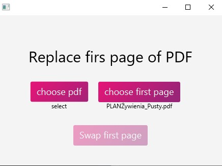

# Simple app for swaping first page of given PDF file with secon one
## Build with
- Kotlin 🔥
- TornadoFx for building UI 🖥
- Apache pdfbox for dealing with pdf 📃
- ShadowJar for building jar 🚧
## How it works

There are 3 button:
1. Chose pdf - select your main pdf
1. Chose first page - select pdf file that have only one first page
1. Swap first page - that will swap first page by:
    1. removing first page from pdf 1,
    1. adding pdf chosen in button 2 at the beggining of pdf 1 
    1. saving on your computer by default in pdf1Path-{date}.pdf 
   
## How to build
`gradlew shadowJar` 
it will produce file in build/libs
## Project structure

| File                                                                               | purpouse                                                               |
|------------------------------------------------------------------------------------|------------------------------------------------------------------------|
|[PdfEditor.kt](/src/main/kotlin/xyz/manka/pdffirstpageswaper/services/PdfEditor.kt) | file responsible for editing pdf file, for naw only swaping first page |
|[BasicStyles.kt](/src/main/kotlin/xyz/manka/pdffirstpageswaper/views/BasicStyles.kt)| Styles for view                                                        |
|[BasicView.kt](/src/main/kotlin/xyz/manka/pdffirstpageswaper/views/BasicView.kt)    | main view for now the only one                                         |
|[constants.kt](/src/main/kotlin/xyz/manka/pdffirstpageswaper/constants.kt)          | all constants                                                          |

### Constants
| Constant               |description                                                                            | value                                               |
|------------------------|---------------------------------------------------------------------------------------|-----------------------------------------------------|
|DATE_SUFFIX_PATTERN     |date pattern for suffix                                                                | "yyyy-MM-dd"|
|PRIMARY_COLOUR          |primary colour of button gradient                                                      | "#e61577"|
|SECONDARY_COLOUR        |secondary colour of button gradient                                                    |"#992478"|
|SHADOW_COLOUR           |shadow colour of button                                                                |"#d63382"|
|FIRST_PAGE_DEFAULT_PATH |default first page path (for now its set for user home directory)| "home\\Documents\\firstPage.pdf"|
